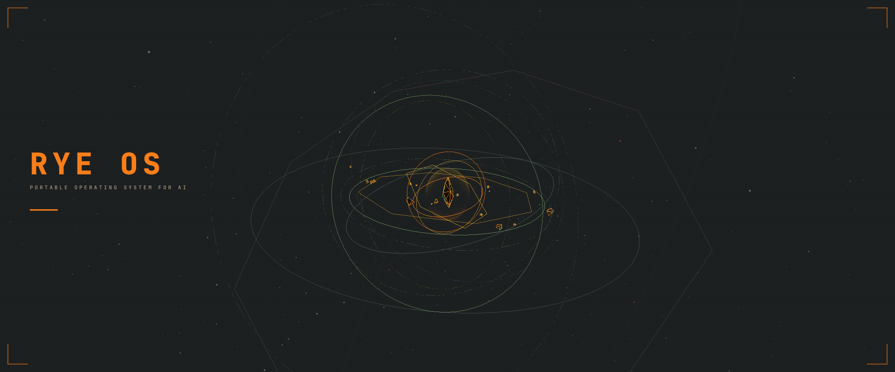

<!-- [](https://ryeos.net) -->

# RYE OS

> _"In Linux, everything is a file. In RYE, everything is data."_

RYE is a portable operating system for AI. It gives any LLM a persistent, signed workspace — directives, tools, and knowledge — that travels with you across projects, machines, and models. Four MCP tools. One substrate.

| Tool      | Purpose                                  |
| --------- | ---------------------------------------- |
| `search`  | Find items across all spaces             |
| `load`    | Read or copy items between spaces        |
| `execute` | Run a directive, tool, or knowledge item |
| `sign`    | Cryptographically sign items             |

---

Most agent frameworks treat the model as something you call. RYE treats it as something you _are_.

RYE gives you a signing key, your identity inside the system. Every item that flows through RYE carries a signature — yours, or from authors you trust. When you hand that off to a thread, push it to the registry, or run it six months from now in a different project, the chain of custody is intact. RYE knows who built it, and it knows it hasn't been touched. The registry extends this: pull signed items from the community, trust the author, and they flow through the same integrity checks as your own.

That's not just a security feature. It's a framing: you're not configuring a tool, you're establishing an identity inside a system that multiple models — Claude, GPT, Gemini, whatever comes next — will operate within. Swap the model. The substrate remains. Your signed tools remain. The capabilities you've defined remain. The intelligence compounds.

RYE is the policy and orchestration layer that MCP is missing.

---

## How It Works

RYE inverts the relationship between code and data. Runtimes, retry logic, error classification, provider configs — all swappable YAML files, not hardcoded behavior. Adding a new language runtime is a YAML file. No code changes, no recompilation.

At the base is Lillux, a microkernel that handles OS-level primitive execution. Every tool call follows a signed chain: your tool → a runtime that defines how to run it → a Lillux primitive that executes. Each element verified before anything runs. Tampered items are rejected. No fallback. No bypass. RYE never sees your environment variables or secrets — that happens at the Lillux and OS level, below RYE entirely.

Orchestration follows the same philosophy. Spawn child RYE threads as separate processes. Budgets cascade — children can never spend more than the parent allocated. Capabilities attenuate — each level can only have equal or fewer permissions than its parent. Full transcripts are readable in real time.

Workflows can be defined as declarative YAML state graphs — deterministic steps and LLM reasoning are routed through the same execution layer.

---

## Install

```
pip install ryeos-mcp
```

> **From source:**
>
> ```
> git clone https://github.com/leolilley/ryeos.git
> cd ryeos/ryeos-mcp
> pip install -e .
> ```

```json
{
  "mcpServers": {
    "rye": {
      "command": "ryeos-mcp",
      "env": {
        "USER_SPACE": "/home/you"
      }
    }
  }
}
```

> `USER_SPACE` sets the base path for your user-level `.ai/` directory (defaults to `~`). See [Installation docs](docs/getting-started/installation.md) for per-client examples and other environment variables.

**Then direct RYE to initialise by expressing the intent:**

> _"rye execute directive init"_

RYE operates through your model and harness of choice. Successfully actioning the baseline init directive demonstrates the compatiblity of your chosen model and harness to follow RYE directives and context.

The baseline init directive instructs RYE to handle your system setup and guide you through RYE itself.

---

## Packages

| Package        | What it provides                                                    |
| -------------- | ------------------------------------------------------------------- |
| `lillux`       | Microkernel — subprocess, HTTP, signing, integrity primitives       |
| `ryeos-engine` | Execution engine — resolver, executor, metadata                     |
| `ryeos-core`   | Minimal bundle for core rye functionality (`rye/core/*` items only) |
| `ryeos`        | Standard bundle — agent, bash, file-system, MCP, primary actions    |
| `ryeos-mcp`    | Standard bundle + MCP server transport (stdio/SSE)                  |
| `ryeos-cli`    | Standard bundle + terminal CLI — maps shell verbs to the four primitives |
| `ryeos-remote` | Remote execution server — CAS-native sync, materializer, thread tracking, Modal deployment |

> **Note:** The CLI is a developer/debugging tool, not the primary interface. RYE is designed to be driven by an AI agent through MCP — use `ryeos-mcp` for normal usage.

Both `ryeos` and `ryeos-mcp` support optional extras:

```
pip install ryeos[web]          # browser automation, fetch, search tools
pip install ryeos[code]         # git, npm, typescript, LSP, diagnostics tools
pip install ryeos[all]          # both web and code
pip install ryeos-mcp[web]      # MCP server + web bundle
pip install ryeos-mcp[code]     # MCP server + code bundle
pip install ryeos-mcp[all]      # MCP server + all bundles
```

Fully modular and extendable.

## Remote Execution

Run tools and state graphs on a remote server without exposing your private signing key. The system uses content-addressed storage for sync — objects are synced by hash, execution happens in a temp-materialized `.ai/` directory, and results flow back as immutable CAS objects. The remote executor has its own Ed25519 identity and signs execution artifacts independently.

```bash
pip install ryeos-remote          # server package (deployed on Modal)
```

Named remotes are configured in `cas/remote.yaml`:

```yaml
remotes:
  default:
    url: "https://ryeos-remote--execute.modal.run"
    key_env: "RYE_REMOTE_API_KEY"
  gpu:
    url: "https://gpu-worker--execute.modal.run"
    key_env: "GPU_REMOTE_API_KEY"
```

Target a remote via the `thread` parameter:

```python
rye_execute(item_type="tool", item_id="my/heavy-compute", thread="remote:gpu")
```

State graph nodes can also specify per-node remotes for hybrid local/remote workflows.

See the [Remote Execution docs](docs/internals/remote-execution.md) for the full architecture.

## Documentation

Full documentation at [`docs/`](docs/index.md):

- **[Getting Started](docs/getting-started/installation.md)** — Installation, quickstart, workspace structure
- **[Authoring](docs/authoring/directives.md)** — Writing directives, tools, and knowledge
- **[MCP Tools Reference](docs/tools-reference/execute.md)** — The four agent-facing tools
- **[Orchestration](docs/orchestration/overview.md)** — Thread-based multi-agent workflows
- **[State Graphs](docs/orchestration/state-graphs.md)** — Declarative YAML workflow graphs
- **[Registry](docs/registry/sharing-items.md)** — Sharing items, trust model, agent integration
- **[Internals](docs/internals/architecture.md)** — Architecture, executor chain, spaces, signing

---

MIT License
